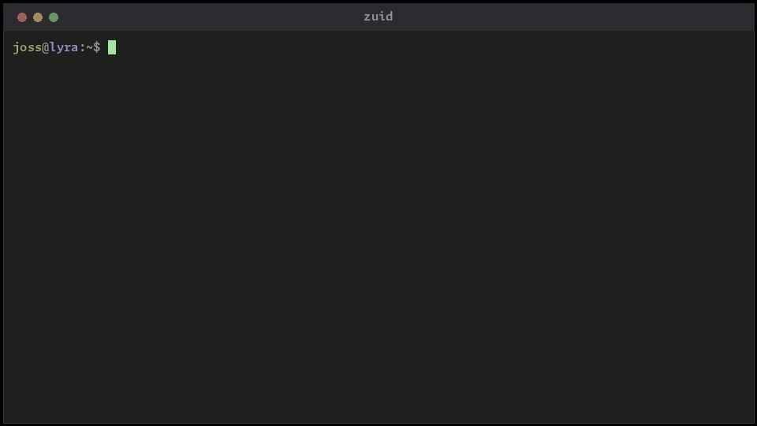

<!-- markdownlint-disable MD007 -- Unordered list indentation -->
<!-- markdownlint-disable MD010 -- No hard tabs -->
<!-- markdownlint-disable MD033 -- No inline html -->
<!-- markdownlint-disable MD055 -- Table pipe style [Expected: leading_and_trailing; Actual: leading_only; Missing trailing pipe] -->
<!-- markdownlint-disable MD041 -- First line in a file should be a top-level heading -->
<div align="center">

[](https://www.gnu.org/licenses/old-licenses/gpl-2.0.html)


</div>
<!--
[](https://www.gnu.org/software/bash/)
[](https://www.python.org/)
[](https://www.rust-lang.org/)


[](https://www.javascript.com)

[](https://www.gnu.org/licenses/old-licenses/gpl-2.0.html)

[](https://opensource.org/licenses/MIT)
[](https://opensource.org/licenses/MPL-2.0)


[](https://github.com/sponsors/jim-collier)
-->

<!-- TOC ignore:true -->
# ZUID

Short, sortable, privacy-preserving unique identifiers - from a command line, a Go module, or a C module.

<div align="center">



<!-- Video walkthrough: https://www.youtube.com/watch?v=REPLACE_ME -->

</div>

> **Pre-alpha.** Both implementations build and reproduce the shared test vectors, and every component works from the command line, the Go module, and the C module. Configuration files, emitting more than one identifier per run, and releases for platforms other than Linux are still to come. See [project/backlog.md](project/backlog.md) for where it actually stands.

<!-- TOC ignore:true -->
## Table of contents

<!-- TOC -->

- [Why](#why)
- [Features](#features)
- [How it is built](#how-it-is-built)
- [Installation](#installation)
	- [Packages and installers](#packages-and-installers)
	- [Direct install script](#direct-install-script)
	- [Do it yourself](#do-it-yourself)
- [Setting up a development environment](#setting-up-a-development-environment)
	- [Prerequisites](#prerequisites)
	- [Building and testing](#building-and-testing)
- [Copyright and license](#copyright-and-license)

<!-- /TOC -->

## Why

A UUID is 36 characters, sorts meaninglessly, and is awkward to read over a phone. Most of the time that buys uniqueness nobody needed.

An identifier built from a timestamp and rendered in a compact base is far shorter, sorts in creation order as plain text, and is still unique enough for the job. When it is not, more components can be mixed in - more time precision, host, user, hardware address, a UUID, or random data - and the same identifier gets as unique as required.

Host and user components are hashed by default, so an identifier does not leak where it came from.

```
$ zuid                          # the default: a timestamp, base 62, to the second
1wqd1q
$ zuid -f='%d%r'                # plus six random symbols, for same-second uniqueness
1wqd1wDppAd6
$ zuid -f='%d-%h-%u' -p='1'     # millisecond precision, with a hashed host and user
0VRArWn2-rw79Mr05-6UI3mO4y
```

Every component is a fixed width, so identifiers line up in a column, sort as text, and can be split back into their parts by offset.

## Features

- Identifiers are as short as necessary, but no shorter.

- Sorts by creation time, as text, with no special comparison function.

- Uniqueness and length are yours to trade off.

- Private by default. Host and user are hashed unless asked otherwise.

- A curated set of bases suited to identifiers, with the library's full set of seventy-odd still available.

- Embeddable, three ways:

	- A standalone command.

	- A permissively licensed Go module.

	- A C module, for nearly anything else. Also permissively licensed.

## How it is built

Base conversion is not reimplemented here. It comes from [convert-base-v2](https://github.com/jim-collier/convert-base-v2), so there is one definition of what a base means rather than two that can drift apart.

There are two implementations of the identifier spec, one in Go and one in Zig, and a shared table of test vectors that both have to reproduce. That is more work than one implementation with bindings around it, and it is deliberate: the two check each other, and neither is forced into the other's constraints.

The Go module stays free of cgo and cross-compiles statically. The Zig side produces the command and the C module. Full reasoning is in [project/design.md](project/design.md).

## Installation

### Packages and installers

Preferred, once there are releases to install. Nothing is published yet, so for now use [Do it yourself](#do-it-yourself) below.

| Platform | Package |
| :-- | :-- |
| Debian, Ubuntu | `zuid_<version>_amd64.deb` |
| Fedora, RHEL, openSUSE | `zuid-<version>.x86_64.rpm` |
| Anything else | the `.tgz`, or the bare binary |

Windows, macOS, BSD, and ARM builds are not produced yet. The command embeds a WebAssembly runtime, and one is vendored per platform; the rest follow once those are in place.

### Direct install script

Both scripts download the latest release, check it against the published checksums, say what they are about to do, and ask before touching anything. Re-running one is a no-op when nothing changed, and `--uninstall` reverses it.

Linux, BSD, macOS, and WSL:

~~~bash
bash <(curl -fsSL https://raw.githubusercontent.com/jim-collier/zuid/main/install.bash)  [--release stable|dev]  [--target user|system]  [--arch x86_64|arm64]
~~~

Windows, Linux, and macOS, under PowerShell 7 or newer:

~~~powershell
& ([scriptblock]::Create((irm 'https://raw.githubusercontent.com/jim-collier/zuid/main/install.ps1')))  [-Release dev|stable]  [-Target user|system]  [-Arch x86_64|arm64]
~~~

Where things go:

| OS | System install | Command | User install | Command |
| :-- | :-- | :-- | :-- | :-- |
| Linux | `/opt/zuid/` | `/usr/local/bin/zuid` | `~/.local/share/zuid/` | `~/.local/bin/zuid` |
| BSD | `/usr/local/zuid/` | `/usr/local/bin/zuid` | `~/.local/share/zuid/` | `~/.local/bin/zuid` |
| macOS | `/opt/zuid/` | `/usr/local/bin/zuid` | `~/Library/Application Support/zuid/` | `~/.local/bin/zuid` |
| Windows | `C:\Program Files\zuid\` | add the `bin` folder to `%PATH%` | `%LOCALAPPDATA%\Programs\zuid\` | add the `bin` folder to `%PATH%` |

A user install is the default when the system location is not writable.

### Do it yourself

Clone the repository and run `cicd/cicd.bash`. It fetches what it needs, builds both sides, and runs the tests. The command ends up at `zig/zig-out/bin/zuid`, and a full run also copies it to the first of `~/.local/bin` or `~/bin` that exists, so what is on your path is the build that just passed. `--no-dogfood` turns that off.

For the Go module, no install step is needed:

~~~bash
go get github.com/jim-collier/zuid/go
~~~

## Setting up a development environment

### Prerequisites

| Tool | Version | Needed for |
| :-- | :-- | :-- |
| Go | 1.24 or newer | the Go module, and building the WebAssembly module the Zig side embeds |
| Zig | 0.16.0 | the command and the C module |
| git, curl, tar, sha256sum | any | fetching and verifying the vendored runtime |
| gcc or clang | any | checking that a foreign toolchain can use the C module |
| shellcheck | any | linting the build script |

Optional, and each stage that wants one skips itself with a note when it is missing:

| Tool | Used for |
| :-- | :-- |
| nfpm | building `.deb` and `.rpm` packages |
| python3 with pillow, gifsicle | rendering the demo animation |
| perf, inferno | profiling the command |

Nothing has to be installed system-wide beyond those. The WebAssembly runtime and the conversion module are fetched or built into `zig/vendor/`, which is not committed.

### Building and testing

`cicd/cicd.bash` drives everything and is what to run before merging.

~~~bash
cicd/cicd.bash                      # build and test both sides
cicd/cicd.bash --quick              # skip the cross builds, profiling, and demo
cicd/cicd.bash --only go            # one toolchain, so only that one has to exist
cicd/cicd.bash --cross              # add the Go cross-compile checks
cicd/cicd.bash -m "message"         # commit too, refusing on main and dev
~~~

Underneath it is just `cd go && go build ./...` and `cd zig && zig build`. The Zig half needs `cicd/cicd.bash` to have run at least once first, since that is what populates `zig/vendor/`.

Both sides have to reproduce every row of `testdata/vectors.tsv` before anything merges. That file is the specification in executable form, so a change to the identifier format means regenerating it and re-running both.

Run logs, profiles, and demo renders land under `cicd/artifacts/`, which is rotated and not committed.

## Copyright and license

The command is GPL-2.0-or-later. Full text in [LICENSE.txt](LICENSE.txt) and [zig/cmd/LICENSE.txt](zig/cmd/LICENSE.txt).

The Go and C modules are Apache-2.0, so that embedding one carries no obligation beyond attribution. Full text and attribution sit next to each module: [go/LICENSE.txt](go/LICENSE.txt) + [go/NOTICE.txt](go/NOTICE.txt), and [zig/lib/LICENSE.txt](zig/lib/LICENSE.txt) + [zig/lib/NOTICE.txt](zig/lib/NOTICE.txt).

> Copyright © 2026 Jim Collier (CryptogID: ѳ6ᴚ℈𐀘𐇦ɛ𐊁¥Mﾏb϶Δ𐌞)<br />
> Licensed under the [GNU General Public License v2.0 or later](https://spdx.org/licenses/GPL-2.0-or-later.html)<br />
> SPDX-License-Identifier: `GPL-2.0-or-later` <br />
> No warranty.<br />
> ZUID™ is a [trademark](trademark.md) of Jim Collier.
<!--
> Copyright © 2026 Jim Collier (CryptogID: ѳ6ᴚ℈𐀘𐇦ɛ𐊁¥Mﾏb϶Δ𐌞)<br />
> Copyright © 2026 t00mietum (CryptogID: กᛦϾ2𐃭ขᚭɘƌფｸᛏﾅh𐌞)<br />
> Copyright © 2026 Bubbles (CryptogID: 7६⋏𐇤𐃋𐀍หԏ๙ኦ𐇔𐀣ษʭ𐌞)<br />

> Licensed under the [MIT License](https://mit-license.org/)<br />
> SPDX-License-Identifier: `MIT`.<br />
	- Most permissive and least protective

> Licensed under the [GNU General Public License v2.0](https://www.gnu.org/licenses/gpl-2.0.html).

> Licensed under the [GNU General Public License v2.0 or later](https://spdx.org/licenses/GPL-2.0-or-later.html).
> SPDX-License-Identifier: `GPL-2.0-or-later`<br />

> Licensed under the [GNU General Public License v3](https://www.gnu.org/licenses/gpl-3.0.en.html) license.

> Licensed under the [Mozilla Public License 2.0](https://mozilla.org/MPL/2.0/).

> Licensed under the [Apache 2.0 License](https://www.apache.org/licenses/LICENSE-2.0.html)
> SPDX-License-Identifier: `Apache-2.0`<br />
	- Permissive
	- Patent protection clause
	- Requires attribution
	- No contribute back
	- SaaS loophole
-->
